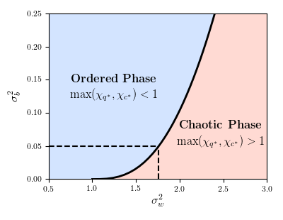
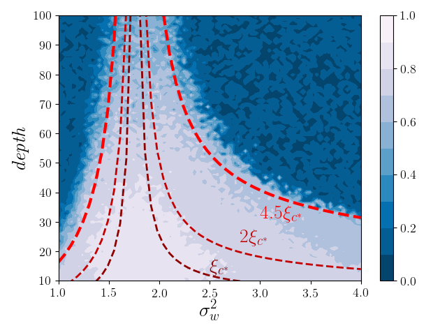

# Mean Field Fully-Connected DNN

## Overview
Official experiment implementation of the following paper:
> [**Deep Learning Theory Review: An Optimal Control and Dynamical System Perspective.**](https://)

<!-- by Guan-Horng Liu and  Evangelos A. Theodorou,  -->
The repo reproduces some of the results from the [Deep Information Propagation](https://arxiv.org/pdf/1611.01232.pdf) paper. However, it is not the official release of DIP. Most APIs in `meanfield.py` are consistent with the [mean-field-cnns](https://github.com/brain-research/mean-field-cnns) repo.

Contribution is wellcomed. Plase cite the following BibTex if you find this repo helpful.


## Dependencies

- Python3
- Pytorch

## Run
### Phase Diagram
``` bash
python3 plot-phase-diagram.py
```
- Result:



### Trainability and Depth Scale on MNIST
``` bash
python3 plot-trainability.py \
        --depth-scale-file 'depth_scale.npz' \
        --train-acc-file 'train_acc.npz'
```
- You can specify the argument `--{depth-scale,train-acc}-file` to load the pre-computed results; otherwise it will run the full experiment from scratch. 
- Other arguments for the hyper-parameters (e.g. learning rate, batch size... etc) of the training process can be founded in `plot-trainability.py`

- Result:

